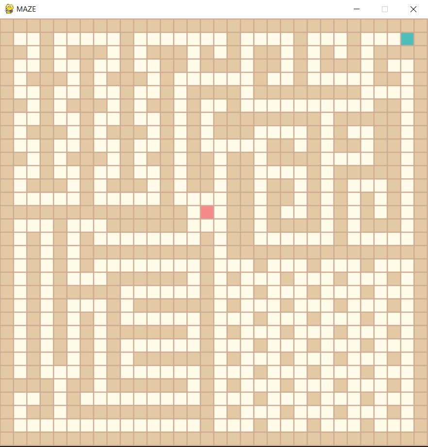
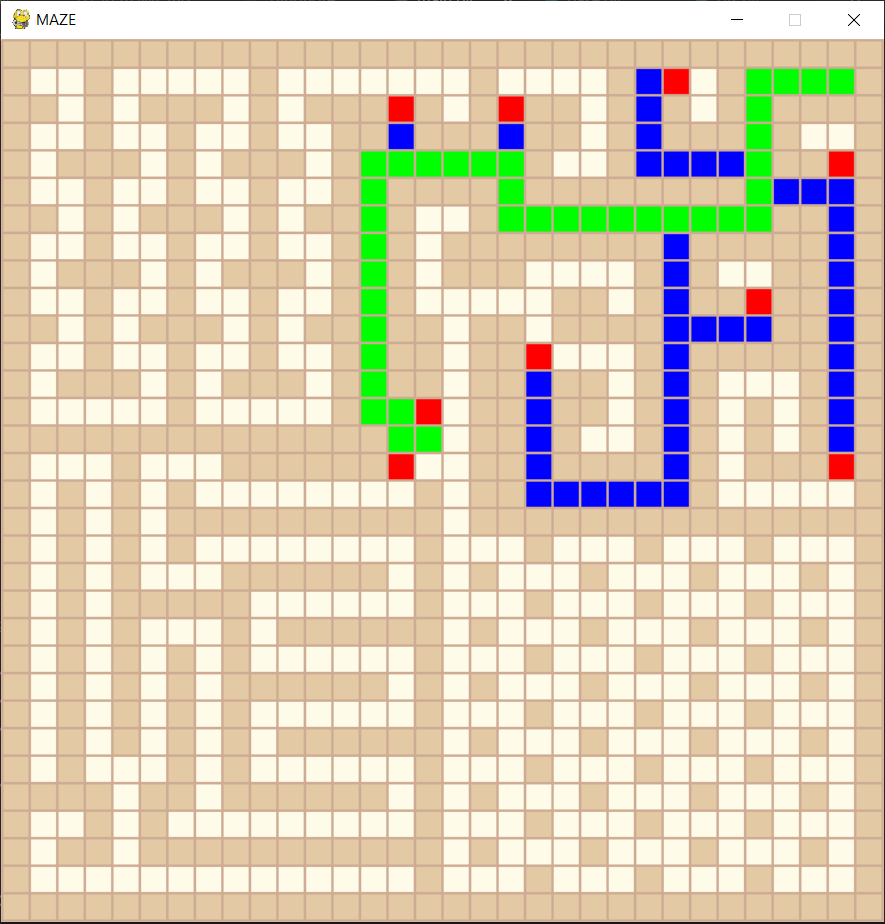

# ai-algorithms
Demonstration of AI algorithms for maze path finding

## How to use
### How to run
`python main.py`

### Shortcuts
#### Keyboard

1-9  : loads predefined maps (i.e. maze1.txt)

l    : loads previously saved map (maze.txt)

s    : saves the map (maze.txt)

r    : clears the map

f    : fills the map

a    : change algorithm, type the name of the algorithm into the terminal

enter: run the algorithm with current map

#### Mouse

left click: puts an obstacle

right click: puts/removes starting location, puts/removes ending location, removes obstacle

### Algorithms

bfs: breadth first search
dfs: depth first search
ids: iterative deepening search
best_first: Greedy search based on heuristic (Manhattan distance)
astar: A* Star search based on heuristic + real cost
robotpath: an A* Star search that also takes into account wall distance for heuristic to find a path away from walls
### Example Map

### Example Solution

